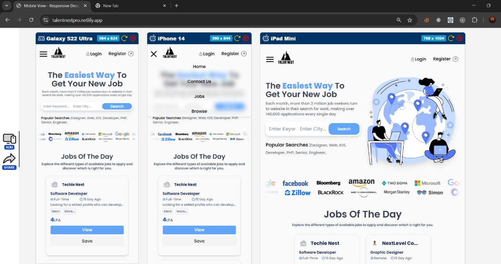
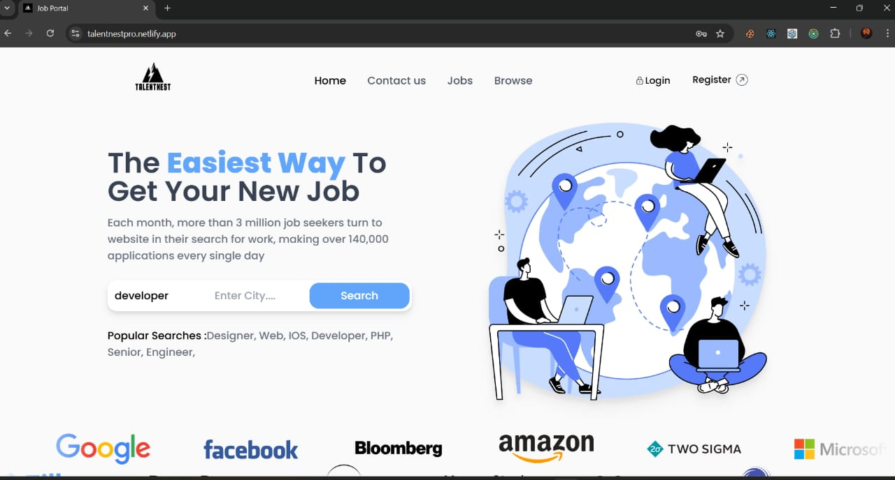
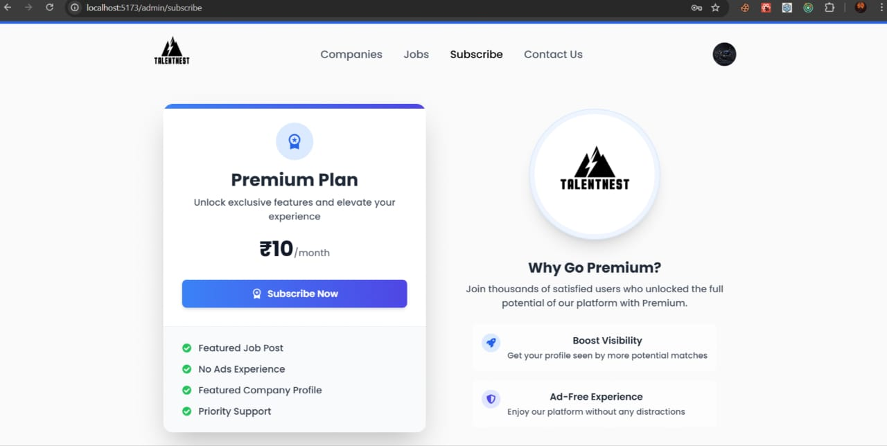

# 💼 TalentNest Pro - MERN Stack Job Portal

A **MERN Stack Job Portal** built to connect recruiters and job seekers through a seamless and modern web experience. This project leverages **React**, **Express**, **MongoDB**, and **Node.js** — with real-time notifications, secure payments, and elegant UI animations.

---

## 🌐 Live Preview

> ⚠️ **Important:**  
> The backend is hosted on **Render**, which suspends the server when idle.  
> 👉 Please **first visit the backend URL** below to wake up the server (this may take a few seconds):

🔗 **Backend API (wake up server first):**  
[https://job-portal-ac6k.onrender.com/api/v1/job/server/info](https://job-portal-ac6k.onrender.com/api/v1/job/server/info)

🔗 **Frontend:**  
[https://talentnestpro.netlify.app/](https://talentnestpro.netlify.app/)

> 🐢 **Note:** The application may respond slowly due to **Render’s free-tier resource limits**.


## 📸 Screenshots:





## 🚀 Key Features

### 👨‍💻 Job Seekers

- 🔍 Advanced job search with filters (salary, location, experience)
- 📄 One-click job applications
- 📊 Application tracking dashboard
- ✉️ Email notifications for application updates

### 👔 Recruiters

- 📢 Create and manage job postings
- 💎 Premium "Job of the Day" feature (Razorpay integration)
- 👥 View and manage applicants
- 📈 Boost job visibility

### 🛠️ Technical Highlights

- ⚡ Real-time notifications with Nodemailer
- 💳 Secure payment gateway (Razorpay)
- 🧊 State management with Redux Persist
- 🎨 Smooth animations with Framer Motion
- 📱 Fully responsive design (Tailwind CSS)

## 🛠️ Tech Stack

### Frontend

- React.js (Vite)
- Redux Toolkit + Redux Persist
- Framer Motion (Animations)
- Tailwind CSS
- Axios (API calls)
- React Hook Form (Forms)
- React Icons

### Backend

- Node.js
- Express.js
- MongoDB (Database)
- Mongoose (ODM)
- JWT (Authentication)
- Bcrypt (Password hashing)
- express-validator

### Services

- Cloudinary (Image storage)
- Razorpay (Payments)
- Nodemailer (Email notifications)
- Render (Backend hosting)
- Netlify (Frontend hosting)
## 🚀 Getting Started
### Prerequisites

- Node.js 
- MongoDB Atlas account or local MongoDB
- Razorpay developer account (for payments)
- Cloudinary account (for image uploads)

### Installation

1. **Clone the repository**

```bash
git clone https://github.com/JatinSasoni/Job-Portal.git
cd Job-Portal
```

### 🔧 Backend Setup

```bash
cd server
npm install
```

### Create a .env file in /server:

```bash
PORT=8000
MONGODB_URI=your_mongodb_uri
SECRET_KEY=your_secret_key
CLOUD_NAME=your_cloudinary_cloud_name
CLOUDINARY_API_KEY=your_cloudinary_api_key
CLOUDINARY_API_SECRET=your_cloudinary_api_secret
COMPANY_NAME=your_company_name
COMPANY_EMAIL=your_company_email
RAZOR_PAY_KEY=your_razorpay_key
RAZOR_PAY_SECRET=your_razorpay_secret
RAZOR_PLAN_ID=your_razorpay_plan_id
```

#### Run the server:

```bash
npm run dev
```

### 🎨 Frontend Setup

```bash
cd client
npm install
npm run dev
```

### Create a .env file in /Client:

```bash
VITE_API_URI=your_backend_api_base_url
VITE_RAZOR_PAY_KEY=your_razorpay_key
VITE_SUBSCRIPTION_PRICE=your_subscription_price
```
### 🚀 Deployment
Frontend: Deployed on Netlify

Backend: Deployed on Render


### 🧩 Folder Structure
- /Client --> React Frontend
- /Server --> Express Backend API

###  🔮 To-Do / Future Enhancements
- ✅ Admin dashboard for management
- ✅ Job analytics for recruiters
- ✅ Enhanced search & filter optimizations
- ✅ Push Notifications
- ✅ Follow and DM recruiters
- ✅ Resume builder

## 📬 Dev?
### Jatin Sasoni :)